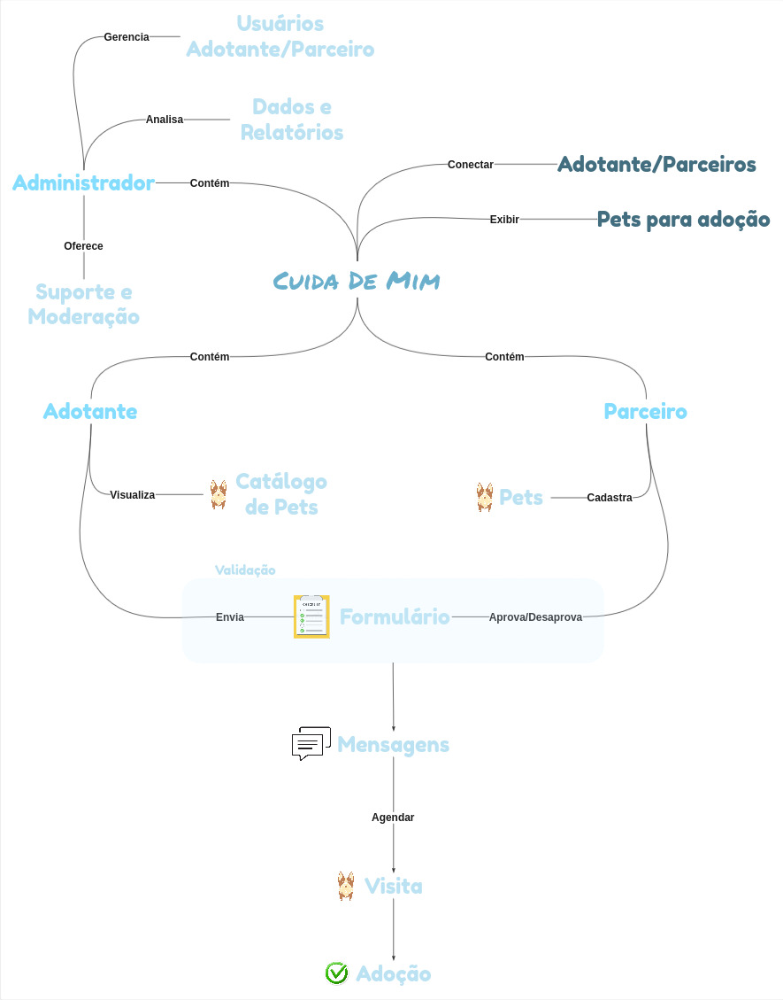

# 1.1.2 Rich Pictures

## Participantes

| Nome | Matrícula | GitHub |
|------|-----------|--------|
| Ian Costa | 222014859 | [@iancostag](https://github.com/iancostag) |
| José Rabelo | 211062016 | [@joseandre25](https://github.com/joseandre25) |
| Davi de Aguiar | 222006641 | [@davi-aguiar-vieira](https://github.com/davi-aguiar-vieira) |
| Wallyson Souza | 222006196 | [@devwallyson](https://github.com/devwallyson) |
| Artur Ricardo | 190102977 | [@algorithmorphic](https://github.com/algorithmorphic) |
| Erick Miranda | 211061672 | [@Erick-ems](https://github.com/Erick-ems) |
| Daniel Ferreira | 222006632 | [@DanielFsR](https://github.com/DanielFsR) |
| Caio Antônio | 221031130 | [@Caio-Antonio](https://github.com/Caio-Antonio) |
| Mateus de Castro | 222015195 | [@mat054](https://github.com/mat054) |
| Vinicius Alves | 190039116 | [@vinialves2020](https://github.com/vinialves2020) |

## Esboço do Ecossistema: O Rich Picture

Após a etapa de "Unpack", onde consolidamos as ideias iniciais em um Mapa Mental, nosso próximo passo foi transformar essa coleção de temas em uma visão integrada e dinâmica do sistema. Para isso, utilizamos a técnica do Rich Picture.

O Rich Picture é, em essência, um esboço (sketch) colaborativo do problema. Diferente de diagramas técnicos como o BPMN, seu objetivo não é ser preciso ou formal, mas sim capturar a complexidade e as relações de um sistema de forma intuitiva e visual. É uma ferramenta de pensamento, projetada para gerar discussão e alinhar o entendimento da equipe sobre o cenário completo.

No nosso esboço da plataforma "CuidaDeMim", posicionamos o sistema no centro e, ao redor, desenhamos os fluxos, as conexões e as tensões entre os três atores principais: o Adotante, o Parceiro (Tutor/ONG) e o Administrador. Mapeamos visualmente como o cadastro de um animal por um parceiro leva à visualização pelo adotante, e como a comunicação e os dados fluem através da plataforma.

Autor: Todos os membros,sintese feita por Mateus, 2025.

## Histórico de Versão

| Versão | Data | Descrição | Autor | Revisor |
| :--- | :--- | :--- | :--- | :--- |
| 1.0 | 03/09/2025 | Criação do template da página | Ian Costa, Erick Santos | Nenhum |
| 1.0 | 04/09/2025 | Adição do Rich Picture e texto | Ian Costa, Mateus de Castro | Nenhum |