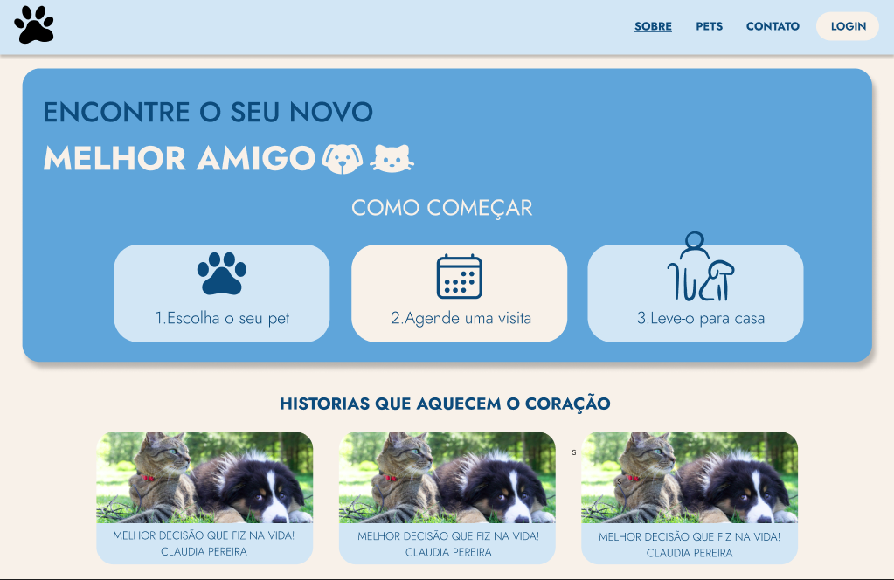
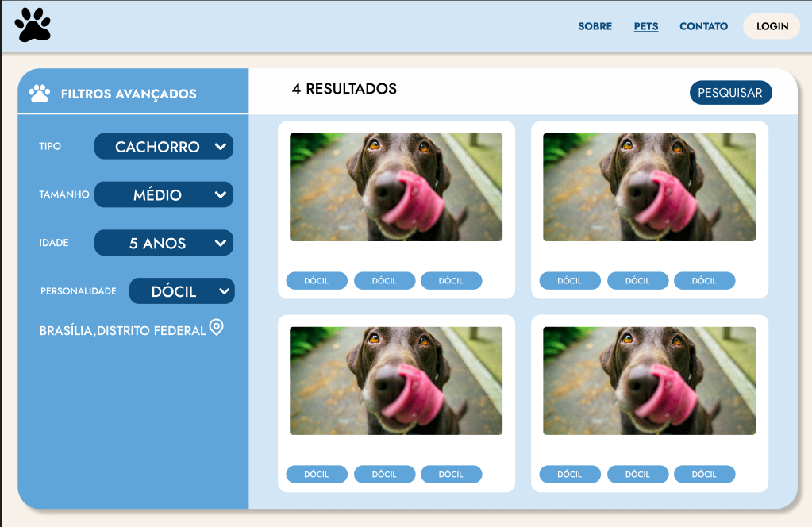
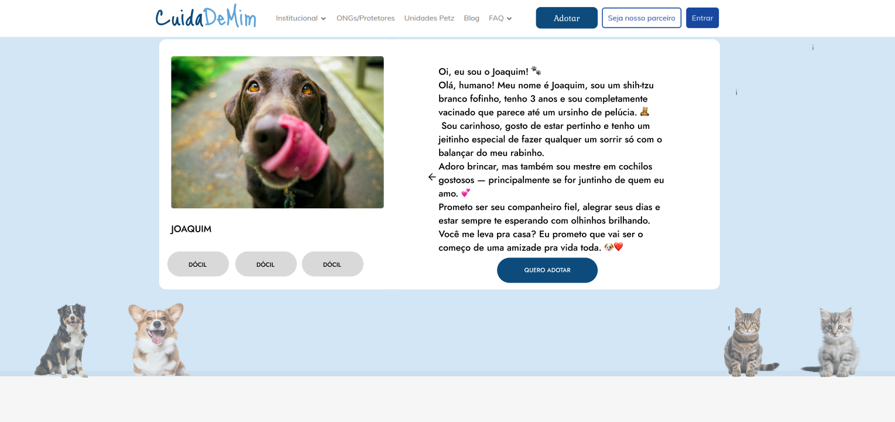
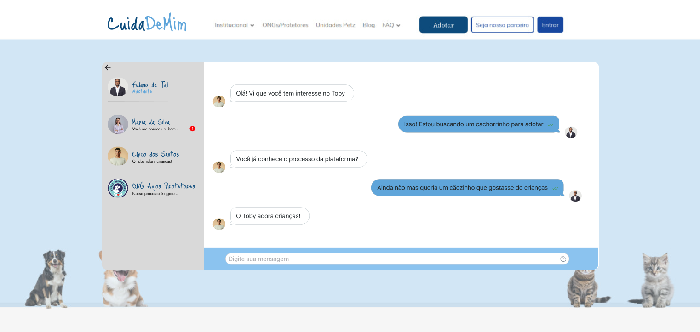

# Protótipo

## Por que usar?
Após a fase conceitual, onde utilizamos o Rich Picture para mapear a complexidade do sistema de adoção e o Storyboard para definir a jornada ideal do usuário, avançamos para a materialização da nossa solução. O artefato a seguir é o protótipo de média fidelidade do site "CuidaDeMim".

## O que é um Protótipo de Média Fidelidade?

Nesta etapa, traduzimos os esboços de baixa fidelidade (rascunhos e fluxos) em uma interface digital interativa. Diferente dos esboços iniciais, o protótipo de média fidelidade foca na arquitetura da informação, no layout das telas e na simulação do fluxo de navegação principal. Embora ainda não contenha o design visual final polido ou todas as funcionalidades complexas, ele nos permite testar a usabilidade central da proposta.

## Objetivo deste Protótipo:

O principal objetivo deste prot ótipo é validar o fluxo de adoção que desenhamos: desde a descoberta do pet no catálogo até o agendamento do encontro através do chat. Queremos verificar se a sequência de ações é intuitiva para o usuário e se a interface proposta resolve efetivamente o problema de simplificar a comunicação entre o adotante e o tutor do animal.

Autor: Vinicius, Davi, Daniel, 2025.

Autor: Vinicius, Davi, Daniel, 2025.

Autor: Erick, 2025.

Autor: Caio, 2025.

## Histórico de Versão

| Versão | Data | Descrição | Autor | Revisor |
| :--- | :--- | :--- | :--- | :--- |
| 1.0 | 04/09/2025 | Criação do template da página e adição dos textos | Ian Costa | Erick Santos |
| 1.1 | 04/09/2025 | Adição das Imagens | Ian Costa | Nenhum |
| 1.2 | 05/09/2025 | Adição dos Autores | Ian Costa | Nenhum |

