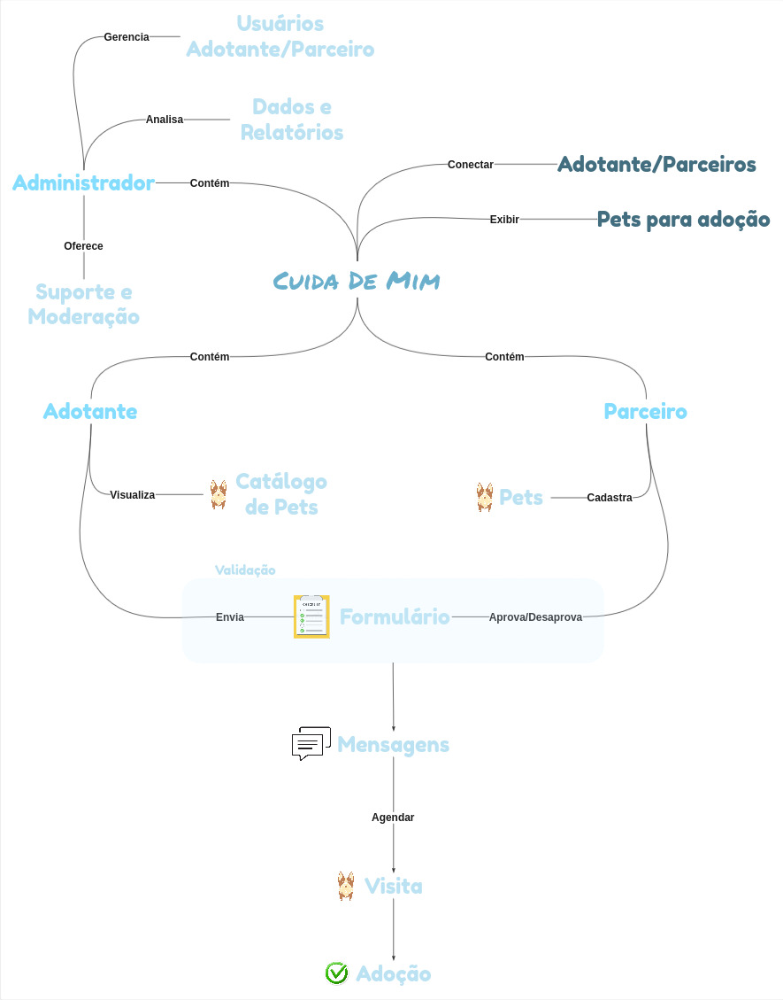

# 1.2. Módulo Artefato Generalista

## Participantes

| Nome | Matrícula | GitHub |
|------|-----------|--------|
| Ian Costa | 222014859 | [@iancostag](https://github.com/iancostag) |
| José Rabelo | 211062016 | [@joseandre25](https://github.com/joseandre25) |
| Davi de Aguiar | 222006641 | [@davi-aguiar-vieira](https://github.com/davi-aguiar-vieira) |
| Wallyson Souza | 222006196 | [@devwallyson](https://github.com/devwallyson) |
| Artur Ricardo | 190102977 | [@algorithmorphic](https://github.com/algorithmorphic) |
| Erick Miranda | 211061672 | [@Erick-ems](https://github.com/Erick-ems) |
| Daniel Ferreira | 222006632 | [@DanielFsR](https://github.com/DanielFsR) |
| Caio Antônio | 221031130 | [@Caio-Antonio](https://github.com/Caio-Antonio) |
| Mateus de Castro | 222015195 | [@mat054](https://github.com/mat054) |
| Vinicius Alves | 190039116 | [@vinialves2020](https://github.com/vinialves2020) |

## Rich Picture

O ponto de partida para o nosso projeto foi a criação de rich pictures individuais por cada membro da equipe. Este exercício inicial permitiu que cada um de nós pudesse expressar livremente sua própria compreensão do problema, com todas as suas complexidades e nuances.

Em uma segunda etapa, consolidamos essas visões individuais em um único rich picture de síntese. Esse processo colaborativo foi fundamental para alinhar nossos entendimentos, identificar pontos de conflito e, o mais importante, construir uma visão unificada e compartilhada do projeto. O rich picture final serviu como uma ferramenta poderosa para esclarecer o escopo e os principais elementos do nosso desafio.

Com essa base sólida e consensual, partimos para o desenvolvimento do nosso storyboard. O rich picture consolidado foi a referência principal para a criação de uma narrativa visual que detalha a jornada do usuário e as funcionalidades chave da solução que estamos propondo."

 

## Mapa Mental

O processo começou com uma sessão de brainstorming individual, onde cada membro da equipe utilizou post-its para registrar ideias, problemas, funcionalidades e requisitos relacionados ao universo da adoção de animais. Em seguida, de forma colaborativa, agrupamos esses post-its por afinidade em um quadro comum.

O Mapa Mental que apresentamos a seguir é o resultado visual e estruturado dessa síntese. Ele organiza as ideias dispersas em categorias centrais, como "Jornada do Adotante", "Necessidades do Parceiro/ONG" e "Funcionalidades Essenciais da Plataforma". Este artefato foi crucial para definir as fronteiras do nosso projeto e serviu como um guia consensual para garantir que todos os membros da equipe estivessem alinhados sobre os problemas que iríamos resolver.

  <iframe loading="lazy" style="position: absolute; width: 100%; height: 100%; top: 0; left: 0; border: none; padding: 0;margin: 0;"
    src="https://www.canva.com/design/DAGx-0p9UKA/o2CtKGa6lX8ZrbboRw6gUw/view?embed" allowfullscreen="allowfullscreen" allow="fullscreen">
  </iframe>

<a href="https:&#x2F;&#x2F;www.canva.com&#x2F;design&#x2F;DAGx-0p9UKA&#x2F;o2CtKGa6lX8ZrbboRw6gUw&#x2F;view?utm_content=DAGx-0p9UKA&amp;utm_campaign=designshare&amp;utm_medium=embeds&amp;utm_source=link" target="_blank" rel="noopener">Mapa mental</a> de Davi Vieira

## Histórico de Versão

| Versão | Data | Descrição | Autor | Revisor |
| :--- | :--- | :--- | :--- | :--- |
| 1.0 | 04/09/2025 | Adição na pages | Ian Costa | Nenhum |