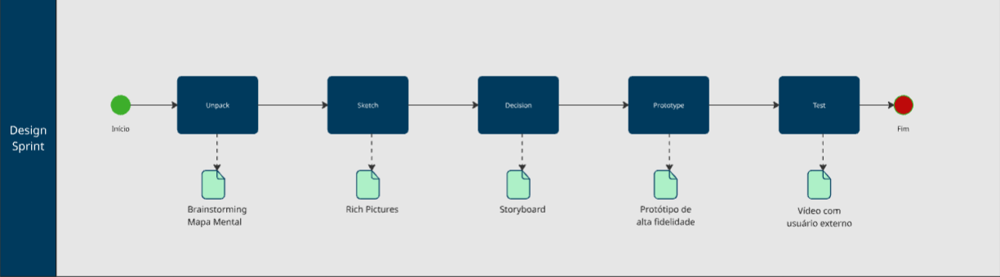

# __Módulo Modelagem BPMN__

## **Introduçao**

A BPMN (Business Process Model and Notation) é uma linguagem padronizada para representar processos de negócio por meio de diagramas visuais. Ela utiliza um conjunto definido de símbolos e regras que permitem mapear fluxos de atividades em diferentes níveis de detalhe, conforme a necessidade do modelo.

## **Metodologia**

Para este projeto de modelagem de software do CuidaDeMim, serão adotadas metodologias ágeis, com ênfase no Scrum e no Extreme Programming (XP). O Scrum será empregado na organização das atividades em sprints e na entrega incremental de resultados, enquanto o XP trará práticas técnicas como desenvolvimento orientado a testes (TDD), refatoração contínua e programação em par, assegurando maior qualidade e flexibilidade.

A integração dessas metodologias favorecerá a evolução contínua do sistema, com foco em colaboração, adaptação às mudanças e entrega de valor constante ao cliente.

## Design Sprint

**Figura 1:** Processo de Sprint Design 

Autor: [José André](https://github.com/joseandre25), 2025.

## BPMN Metodologia

<iframe width="768" height="432" src="https://miro.com/app/live-embed/uXjVJMbW76o=/?embedMode=view_only_without_ui&moveToViewport=-1394,-780,2655,1330&embedId=356591491770" frameborder="0" scrolling="no" allow="fullscreen; clipboard-read; clipboard-write" allowfullscreen></iframe>

Autor: [Ian Costa](https://github.com/iancostag), Daniel Ferreira, Erick, 2025.

## Fluxo BPMN CuidaDeMim

<iframe 
  width="768" 
  height="432" 
  src="https://miro.com/app/live-embed/uXjVJMbuGhY=/?embedMode=view_only_without_ui&moveToViewport=-1220,-924,2319,1799&embedId=699695599953" 
  frameborder="0" 
  scrolling="no" 
  allow="fullscreen; clipboard-read; clipboard-write" 
  allowfullscreen>
</iframe>

Autor: [Ian Costa](https://github.com/iancostag), Daniel Ferreira, 2025.

---

## Histórico de Versão

| Versão | Data | Descrição | Autor | Revisor |
| :--- | :--- | :--- | :--- | :--- |
| 1.0    | 03/09/2025 | Criação inicial do documento e inclusão do BPMN | Daniel, Ian, Erick | Nenhum  |
| 1.1 | 04/09/2025 |BPMN do DS | [José André](https://github.com/joseandre25) | [Ian Costa](https://github.com/iancostag)
| 1.2 | 04/09/2025 |BPMN da metodologia e do processo no site | Ian Costa, Daniel | [Ian Costa](https://github.com/iancostag)
| 1.3 | 05/09/2025 |Atribuição de Autores | Ian Costa, Daniel | [Ian Costa](https://github.com/iancostag)
