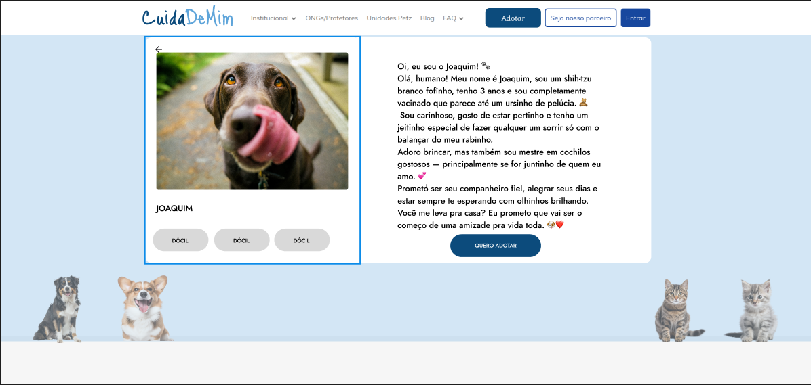

# 1.1.2 Prototipo (Evidências)

## Participantes

| Nome | Matrícula | GitHub |
|------|-----------|--------|
| Ian Costa | 222014859 | [@iancostag](https://github.com/iancostag) |
| José Rabelo | 211062016 | [@joseandre25](https://github.com/joseandre25) |
| Davi de Aguiar | 222006641 | [@davi-aguiar-vieira](https://github.com/davi-aguiar-vieira) |
| Wallyson Souza | 222006196 | [@devwallyson](https://github.com/devwallyson) |
| Artur Ricardo | 190102977 | [@algorithmorphic](https://github.com/algorithmorphic) |
| Erick Miranda | 211061672 | [@Erick-ems](https://github.com/Erick-ems) |
| Daniel Ferreira | 222006632 | [@DanielFsR](https://github.com/DanielFsR) |
| Caio Antônio | 221031130 | [@Caio-Antonio](https://github.com/Caio-Antonio) |
| Mateus de Castro | 222015195 | [@mat054](https://github.com/mat054) |
| Vinicius Alves | 190039116 | [@vinialves2020](https://github.com/vinialves2020) |

## Prototipo

### Erick Santos

### Daniel Ferreira

## Histórico de Versão

| Versão | Data | Descrição | Autor | Revisor |
| :--- | :--- | :--- | :--- | :--- |
| 1.0 | 04/09/2025 | Criação do Template e Adição de Evidência | Erick Santos | Ian |
| 1.1| 04/09/2025 | Adição de Evidência | Daniel | Ian |
