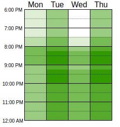

# __Heatmap__

## __O que é um heatmap__

Um __heatmap__, também chamado de mapa de calor, é uma forma de visualizar informações por meio de cores que representam diferentes intensidades ou valores. Ele funciona como um recurso gráfico que destaca áreas com maior ou menor concentração de atividades — como as seções mais acessadas de um site, as regiões mais afetadas por uma epidemia ou ainda as variações de temperatura em um território. Esse tipo de representação torna a análise mais intuitiva, pois facilita a detecção de padrões, tendências e possíveis irregularidades nos dados.

No nosso contexto, o mapa de calor é utilizado para representar a __disponibilidade de tempo__ dos integrantes da equipe, considerando seus compromissos pessoais, acadêmicos e profissionais. Essa visualização nos auxilia a planejar reuniões de forma mais eficiente e respeitosa, reduzindo choques de agenda e evitando sobrecarga. Assim, promovemos uma participação mais engajada e colaborativa de todos, valorizando suas contribuições individuais.

## __Resultados__

Para identificar de forma rápida os horários livres da equipe, utilizamos a ferramenta online when2meet. Nela, cada membro indica os períodos em que está disponível ao longo da semana, deixando em branco os horários em que possui outros compromissos. A partir dessas marcações, o sistema gera automaticamente um mapa de calor que sintetiza a disponibilidade coletiva.

Tabela 1: Heatmap.

Autor: [José André](https://github.com/joseandre25), 2025.

Com base nos dados apresentados na tabela, definimos que os encontros ocorrerão, preferencialmente, às __terças e quintas, às 21h30.__ Esse horário se mostrou o mais adequado para a maioria dos integrantes do grupo, considerando suas disponibilidades e demais compromissos. Além disso, esses momentos favorecem a realização de discussões produtivas sobre os temas relevantes ao nosso projeto.

## Bibliografia

> 1. neil patel. Disponível em: [https://neilpatel.com/br/blog/heatmap-o-que-e/](https://neilpatel.com/br/blog/heatmap-o-que-e/). Acesso em: 04 de Setembro. de 2025.

## Histórico de Versões

| Versão |    Data    |      Descrição       |                      Autor                       | Revisor |
| :----: | :--------: | :------------------: | :----------------------------------------------: | :-----: |
| `1.0`  | 04/09/2025 |  Criação do documento | [José André](https://github.com/joseandre25) |  [Ian Costa](https://github.com/iancostag)   |
