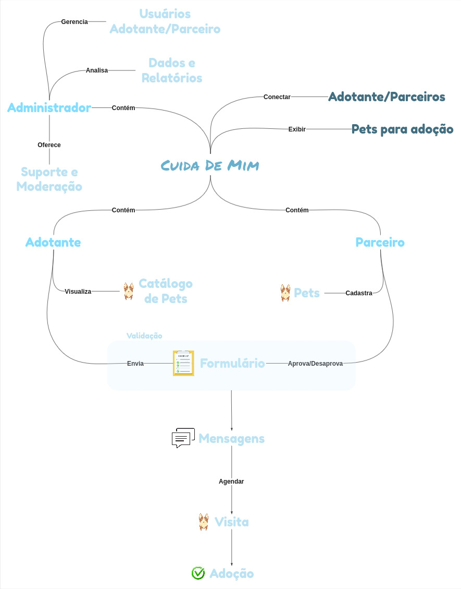
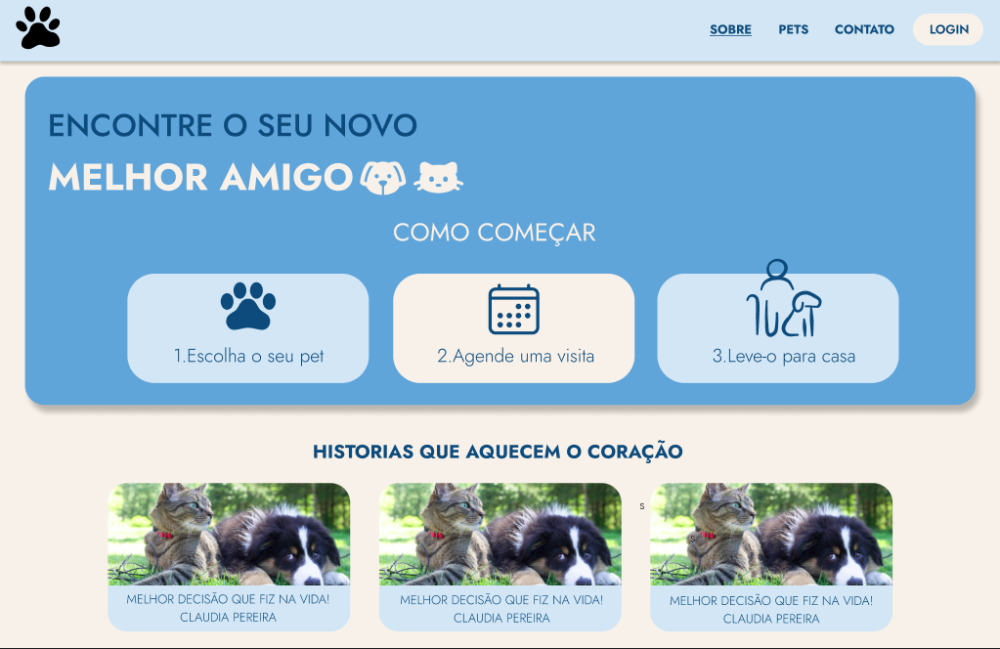
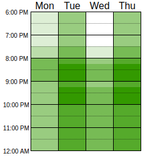

# 🐾 Projeto CuidaDeMim

**Código da Disciplina**: FGA0208 
**Número do Grupo**: 04 
**Entrega**: 01 

## Alunos

| Matrícula   | Aluno                                                                 | Imagem                                                                 |
|-------------|-----------------------------------------------------------------------|------------------------------------------------------------------------|
| 22/2014859  | [Ian Costa](https://github.com/iancostag)                             |       |
| 21/1062016  | [José Rabelo](https://github.com/joseandre25)                         |     |
| 22/2006641  | [Davi de Aguiar Vieira](https://github.com/davi-aguiar-vieira)        |  |
| 22/2006196  | [Wallyson Souza](https://github.com/devwallyson)                      |     |
| 19/0102977  | [Artur Ricardo](https://github.com/algorithmorphic)                   | |
| 21/1061672  | [Erick Miranda](https://github.com/Erick-ems)                         |       |
| 22/2006632  | [Daniel Ferreira](https://github.com/DanielFsR)                       |       |
| 22/1031130  | [Caio Antônio](https://github.com/Caio-Antonio)                       |    |
| 22/2015195  | [Mateus de Castro](https://github.com/mat054)                         |          |
| 19/0039116  | [Vinicius Alves](https://github.com/vinialves2020)                    |   |

---

## Sobre  

O **CuidaDeMim** é um site voltado para a **adoção responsável de cachorros**.  
A plataforma busca facilitar o processo de adoção conectando pessoas interessadas em adotar com animais que precisam de um lar.  

O projeto promove o bem-estar animal, ao mesmo tempo em que incentiva práticas responsáveis e conscientes de adoção.  

Na primeira entrega, o grupo realizou atividades de **Design Sprint**, elaboração de **Rich Picture**, **Mapa Mental**, **Storyboard**, prototipação inicial e modelagem de processos com **BPMN**.  

---

## Screenshots da Primeira Entrega  

### Rich Picture

### Protótipo

### BPMN Design Sprint

### Heatmap

---

## Há algo a ser executado?  

( ) SIM  
(X) NÃO  

---

## Histórico de Versão  

| Versão | Data       | Descrição                                | Autor            | Revisor          |
|--------|------------|------------------------------------------|------------------|------------------|
| 1.0    | 05/04/2025 | Criação inicial do documento             | [Daniel Ferreira](https://github.com/DanielFsR) | [Ian Costa](https://github.com/iancostag) |
| 1.1    | 11/04/2025 | Inclusão de screenshots e artefatos      | [José Rabelo](https://github.com/joseandre25) | [Davi Vieira](https://github.com/davi-aguiar-vieira) |
